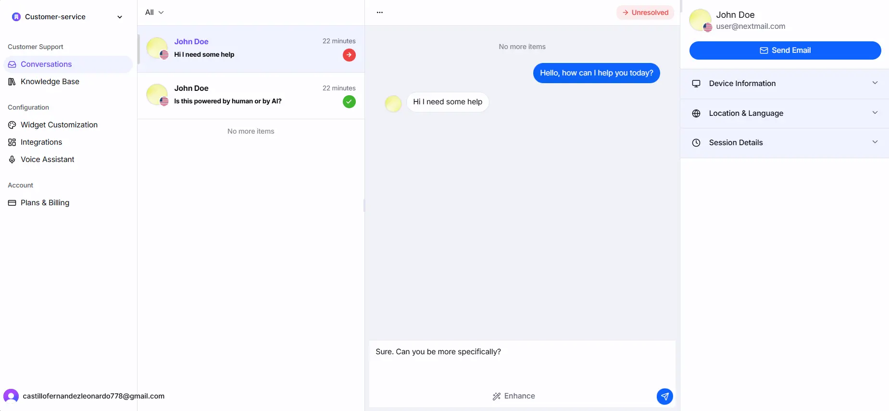
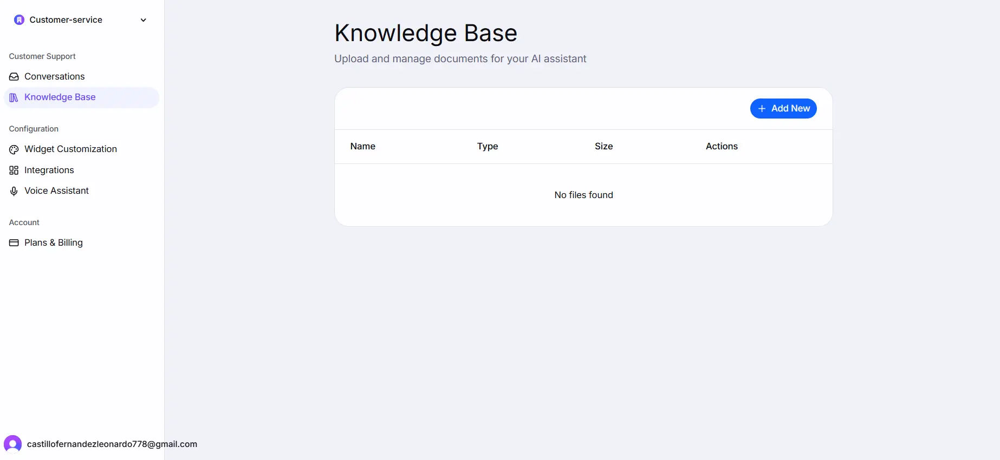
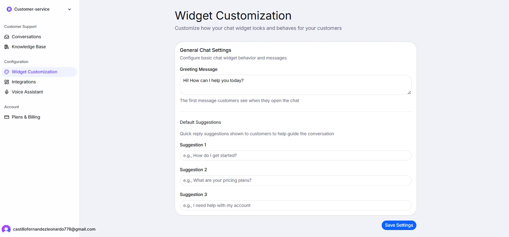
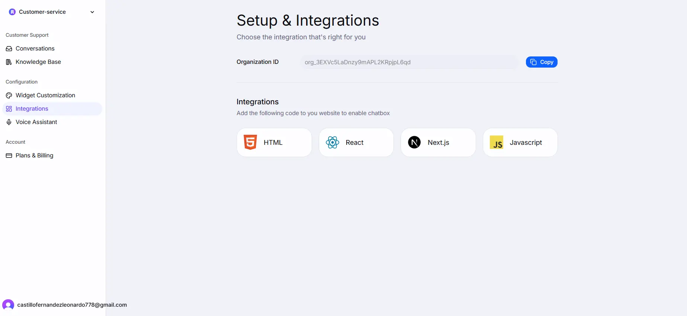
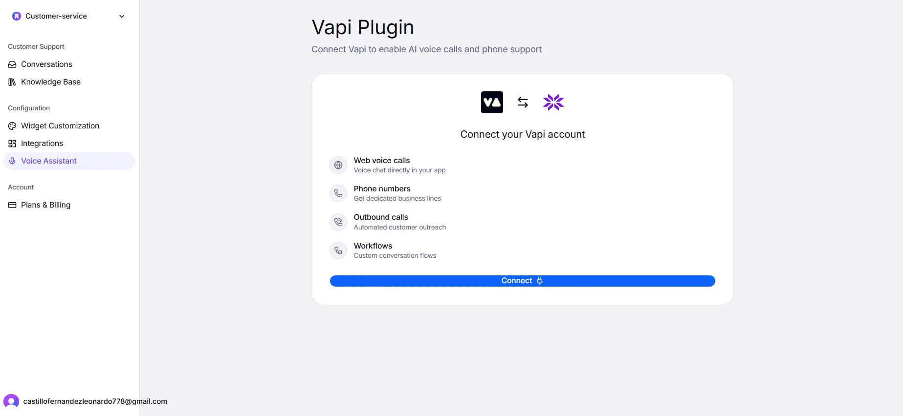
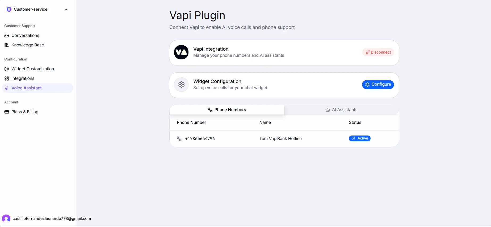
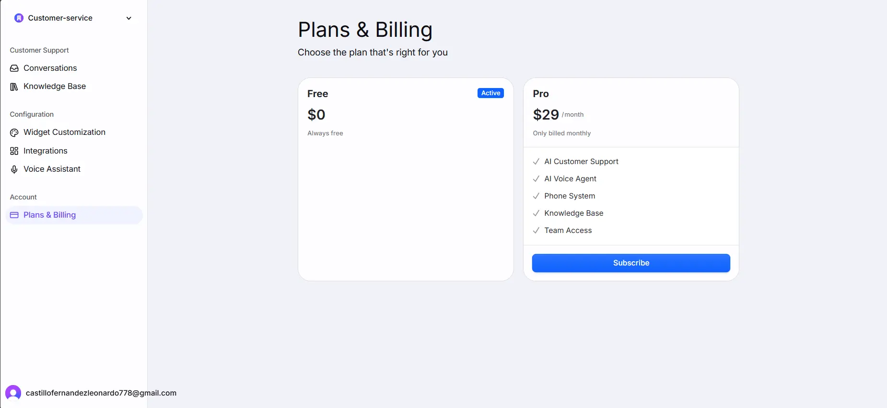
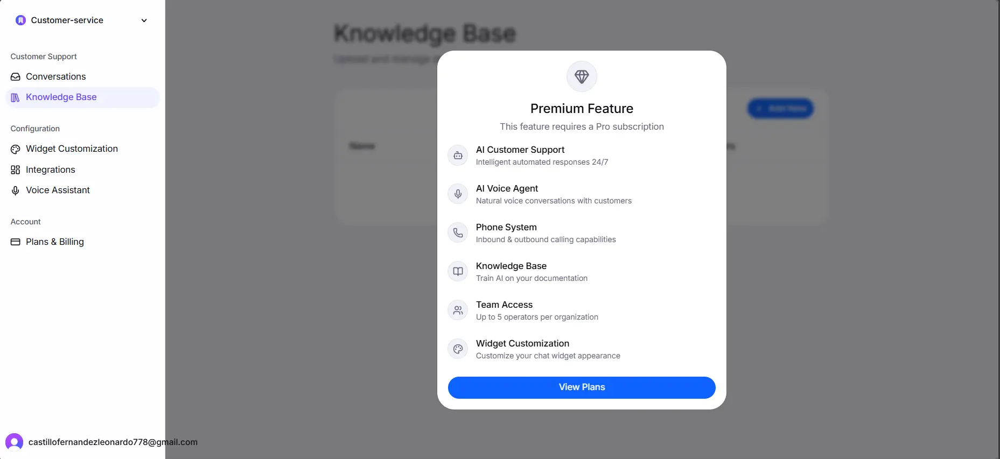
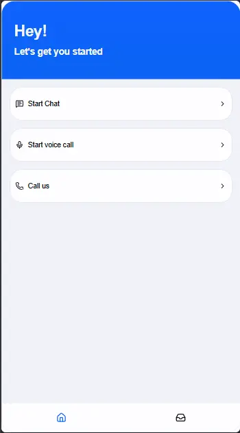

# Echo

Echo is a web-based tool that allows you to provide your customers with a comprehensive customer service experience. It starts with AI-powered automated responses and also allows customers to make voice calls that are automatically answered by an AI agent (Powered by VAPI).

## Technologies Used

### Frontend

- Next.js 16
- React 19
- TypeScript
- Tailwind CSS
- Jotai

### Backend

- Convex
- Typescript

### Infrastructure and Tooling

- AWS Secrets Manager
- VAPI
- Google Gemini AI

## Features

### Web Free Experience

### Web Pro Experience

### Widget Experience

### Operational Domain Features

## How The Project Can Be Improved

## Run Locally

### Prerequisites

### Setup

### Notes

## Views

1. Conversations View
   

2. Knowledge Base View
   

3. Widget Customization View
   

4. Integrations View
   

5. Unconnected Vapi Plugin View
   

6. Connected Vapi Plugin View
   

7. Plans and Pricing view
   

8. Premium Wall
   

9. Widget Chat View
   

10. Widget With Voice Features Enabled
    

## Video
